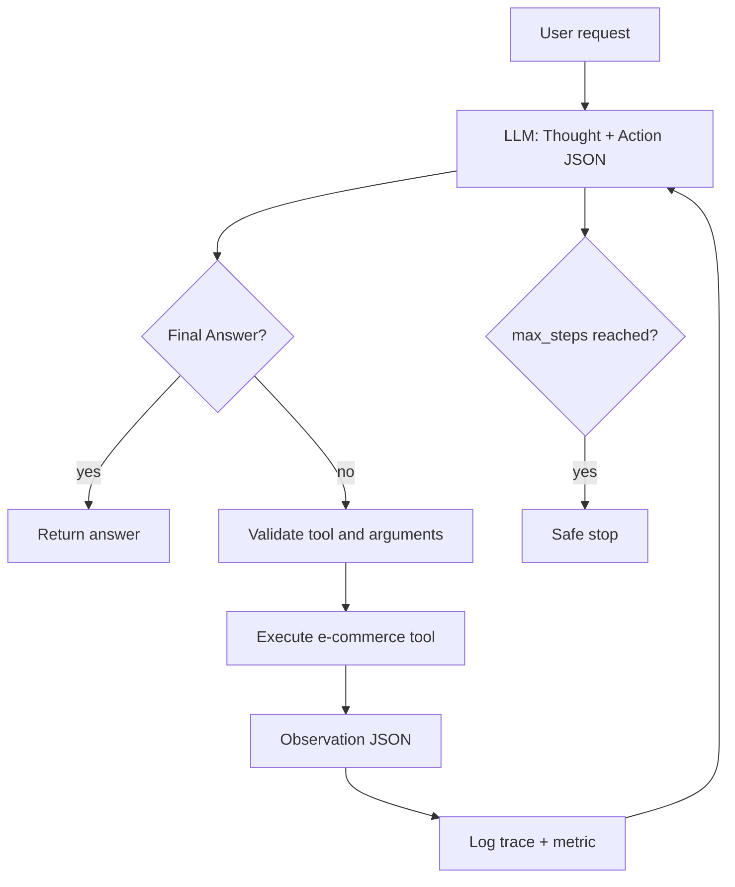

# Group Report: Lab 3 - Production-Grade Agentic System

- **Team Name**: [replace]
- **Team Members**: Le Quoc An, [replace]
- **Deployment Date**: 2026-07-28

## 1. Executive Summary

This lab compares a direct LLM chatbot with a ReAct agent for e-commerce
requests. The chatbot is intentionally unable to query inventory, discounts,
or shipping. The agent uses deterministic tools and feeds each observation into
the next model turn.

> Run `python evaluate.py`, then replace all bracketed metrics below with
> values from `logs/evaluation_*.jsonl` and `logs/YYYY-MM-DD.log`.

- **Success Rate**: [actual value / total]
- **Key Outcome**: [actual result from multi-step purchase case]

## 2. System Architecture & Tooling

### Tool Definitions

| Tool Name | Input Format | Use Case |
|---|---|---|
| `check_stock` | `{ "item_name": string }` | Returns stock, price, and weight. |
| `get_discount` | `{ "coupon_code": string }` | Validates a coupon and returns percentage. |
| `calc_shipping` | `{ "weight_kg": number, "destination": string }` | Returns shipping cost for total weight. |
| `calculate_order_total` | price, quantity, discount, shipping | Computes final total without LLM arithmetic. |

### Providers

- **Current configuration**: Phi-3 Mini 4K Instruct Q4 via `llama-cpp-python`
  on local CPU (model file installed; runtime trace pending).
- **Verified fallback**: Gemini 3.5 Flash completed a five-step purchase trace.
- **Provider-switching evidence still needed**: run the same case on Phi-3 and
  compare its log latency/steps with the Gemini trace.

## 3. Telemetry & Performance Dashboard

Events are written as JSON lines in `logs/YYYY-MM-DD.log`:

- `LLM_METRIC`: provider, model, prompt/completion/total tokens, latency, cost estimate.
- `AGENT_STEP`: exact model response per loop iteration.
- `TOOL_OBSERVATION`: tool results or validation/parser errors.
- `AGENT_END`: success or `max_steps` termination.

| Metric | Result |
|---|---|
| P50 latency | [measure from LLM_METRIC] |
| P99 latency | [measure from LLM_METRIC] |
| Avg. tokens/task | [measure from LLM_METRIC] |
| Test-suite cost estimate | [sum cost_estimate] |

## 4. Root Cause Analysis: Failure Trace

### Case Study: Invalid Coupon / Missing Argument

- **Input**: `Buy 1 iPhone with coupon NOTREAL and ship to Hanoi.`
- **Trace evidence**: [paste `AGENT_STEP` + `TOOL_OBSERVATION` from log].
- **Root Cause**: [state the evidence, not an assumption].
- **v2 Fix**: exact JSON action schema, explicit required arguments, error
  observation returned to the model, duplicate-action guard, and five-step cap.
- **Result**: [paste the new trace after rerun].

## 5. Ablation: Prompt v1 vs v2

| Change | v1 | v2 |
|---|---|---|
| Tool details | Brief label | Exact JSON inputs/outputs and preconditions |
| Action format | Basic JSON instruction | Raw JSON-only action schema |
| Failure handling | No explicit repeat control | Validation + observation + duplicate guard |
| Evidence | `python run_agent.py --version v1 ...` | `python run_agent.py --version v2 ...` |

| Case | Chatbot result | Agent v1 result | Agent v2 result | Winner |
|---|---|---|---|---|
| Simple factual Q | [run] | [run] | [run] | [fill] |
| Two iPhones + WINNER + Hanoi | [run] | [run] | [run] | [fill] |
| Invalid coupon | [run] | [run] | [run] | [fill] |

## 6. Production Readiness

- **Security**: validate tool schemas, authenticate real APIs, and never place
  keys in logs.
- **Guardrails**: bounded five-step loop, parser error observation, and
  duplicate-action block.
- **Scaling**: replace in-memory catalogue with API/RAG data, use asynchronous
  tool execution, and add independent tool-call evaluation.
